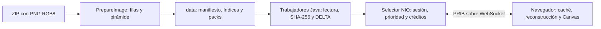
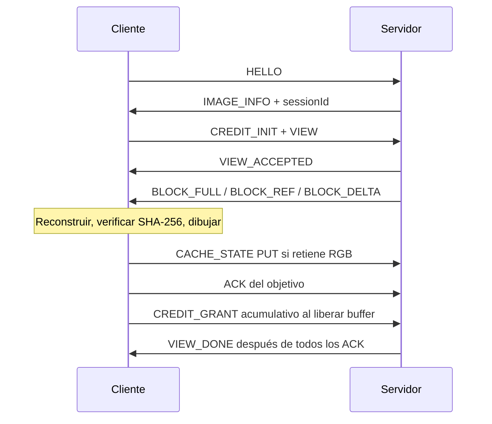

# PRIB v1: documento consolidado del protocolo

Estado al 5 de octubre de 2026. Este documento describe la implementación actual,
no una especificación de funciones futuras. Código y pruebas son la referencia
para resolver discrepancias. Las etapas 1–7 conservan evidencia histórica;
[etapa 7](etapa-7.md) contiene la evaluación del sistema y
[demostración](demostracion.md) permite repetir los mecanismos sin ZIP del curso.

## 1. Problema, alcance y arquitectura

PRIB entrega solo bloques visibles de una imagen grande y permite volver a usar
RGB ya verificado. No transfiere la imagen completa para cada movimiento. La
preparación y el servicio son procesos distintos. Un ZIP disponible no equivale
a una imagen lista para navegar.



| Componente | Responsabilidad y código |
| --- | --- |
| Preparador | `PrepareImage.java`, `PngRows.java`: leer PNG desde ZIP, generar niveles y publicar almacén completo |
| Almacén | `ImageStore.java`: metadatos, registros individuales del índice y lectura/hash de bloques |
| Red | `PribServer.java`, `WebSocketFrames.java`, `Json.java`: HTTP local, framing, Selector y colas |
| Sesión | `PribSession.java`: inventario, generaciones, prioridades, créditos, modos, ACK y RECOVER |
| Diferencias | `DeltaCodec.java`, `SimilarityIndex.java`, `ClientCache.java`: XOR exacto y selección acotada |
| Cliente | `web/app.js`, `cache.js`, `delta.js`: solicitudes, reconstrucción/hash, protección de bases, créditos y dibujo |

Un único hilo Selector modifica las sesiones y el inventario. Cuatro trabajadores
hacen planificación de descriptores, lecturas, firmas y codificación fuera del hilo
de red; entregan resultados mediante una cola de completados y `selector.wakeup()`.
Se permite un trabajo simultáneo por sesión. El catálogo y los recursos web se
cargan al iniciar; agregar imágenes exige reiniciar el servidor.

## 2. Preparación y representación canónica

La entrada soportada es PNG RGB, tres canales de 8 bits, sin entrelazado, dentro
de un ZIP. Se validan firma, IHDR, CRC y filtros PNG. La implementación admite ancho
hasta 200000 píxeles; no es un límite garantizado de rendimiento ni una validación
de todas las imágenes con ese ancho. El tamaño en GB del ZIP no determina la
compatibilidad. La altura debe ser positiva; no tiene el mismo tope explícito.

RGB canónico: bytes R, G, B consecutivos, píxeles de izquierda a derecha y filas
de arriba abajo, sin alfa ni cabecera. SHA-256 se calcula sobre esos bytes, no
sobre PNG, zlib ni JSON. Los bloques miden hasta 128 × 128; los bordes conservan
sus dimensiones reales. Identidad: `imageId` UUID + `blockId="nivel:columna:fila"`.
Las coordenadas `x,y` pertenecen al nivel solicitado, no siempre al original.

Cada nivel divide ancho/alto entre dos redondeando hacia arriba. Un píxel reducido
es el promedio entero por canal de hasta cuatro píxeles, con división hacia abajo.
Los niveles terminan cuando ambas dimensiones son como máximo 128. Cada uno
mantiene una franja de hasta 128 filas; no se materializa una imagen completa en RAM.
La memoria de preparación depende del ancho y los niveles, además del trabajo de
compresión; el servidor posteriormente trabaja por bloques.

El almacén v1 contiene `image.properties`, `level-N.idx` y `level-N.pack`.
Cada registro del índice tiene 48 bytes: offset de 8, longitud de 4, códec de 4 y
SHA-256 de 32. Los enteros del índice usan big-endian. El pack conserva RGB crudo
o zlib cuando comprime mejor. Esto es compresión de disco; FULL en red usa RAW.
El índice se consulta por registro, no se carga completo.

La preparación exige una carpeta nueva y espacio para la suma RGB sin compresión
de todos los niveles, índices y margen de 65536 bytes, más reserva de 256 MiB.
La salida real puede ser menor. `INCOMPLETE` impide servir una preparación parcial;
el manifiesto se publica al final. No se extrae un PNG temporal de imagen completa.

## 3. Transporte y tipos

Servidor restringido a `127.0.0.1`; HTTP GET entrega recursos locales y `/ws` abre
WebSocket v13 sobre TCP. Se validan Host y, cuando existe, Origin. No hay TLS,
autenticación de usuarios, acceso desde otra computadora ni subprotocolo negociado
con `Sec-WebSocket-Protocol`. PRIB v1 se identifica dentro de cada mensaje.
WebSocket usa máscara entrante, fragmentación de texto y ping/pong, sin extensiones.

Los comandos son mensajes de texto JSON UTF-8 planos; se rechazan claves duplicadas,
estructuras entrantes no previstas y tipos incorrectos. Campos comunes:

| Campo | Tipo y significado |
| --- | --- |
| `version` | Entero 1; otra versión se rechaza |
| `type` | Texto con el nombre del mensaje |
| `sessionId` | UUID textual devuelto por IMAGE_INFO; obligatorio después de HELLO |
| `viewId` | Entero positivo de generación cuando aplica; crece estrictamente al pedir vistas |
| `transferId` | Entero de intento de bloque; un reintento recibe otro ID |
| Contadores acumulativos | Enteros exactos en Java/JS, hasta 9007199254740991 para créditos |
| Hashes | 64 caracteres hexadecimales minúsculos SHA-256 |

HELLO no requiere una sesión previa; el navegador envía `sessionId:""`. ERROR
puede no incluir `sessionId`; se procesa antes de validar la sesión. Los campos
adicionales no se usan como negociación de capacidades. Los IDs no representan
usuarios autenticados. Reconectar crea otra sesión y elimina inventario y deuda
anteriores; no hay reanudación de sesión mediante el mismo ID.

## 4. Catálogo de mensajes

Todos llevan `version,type`; salvo las excepciones anteriores, también `sessionId`.
C → S significa cliente a servidor, S → C servidor a cliente.

| Mensaje | Dirección | Campos específicos y regla |
| --- | --- | --- |
| HELLO | C → S | Una vez por conexión; inicia PRIB |
| IMAGE_INFO | S → C | `images` lista de `imageId,name,width,height,levels`; `blockSize,maxBlockBytes,maxCreditBytes,maxCacheBytes,maxCacheEntries,modes,deltaCodec,maxRecoveries` |
| CREDIT_INIT | C → S | `capacityBytes` entre 53252 y 1048576; repetir el mismo valor no reinicia saldo |
| CREDIT_GRANT | C → S | `grantId,releasedBytes` acumulativos; no concede bytes adicionales sin respaldo de datos procesados |
| CREDIT_STATUS | Ambas | Solicitud sin campos específicos; respuesta `capacityBytes,availableBytes,outstandingBytes,releasedBytes,grantId,state` |
| CACHE_STATE | C → S | `cacheSeq,operation`; PUT añade `imageId,blockId,width,height,hash` y firma opcional `similarity`; DROP usa `imageId,blockId`; CLEAR no necesita identidad |
| VIEW / VIEW_UPDATE | C → S | `imageId,viewId,level,x,y,width,height`; ambos tienen la misma semántica en v1 |
| VIEW_ACCEPTED | S → C | `viewId,imageId,level,x,y,width,height,blocks` |
| ACK | C → S | `viewId,transferId,hash` del objetivo reconstruido; no devuelve crédito ni declara retención en caché |
| CANCEL | C → S | `viewId` actual o anterior válido; no admite una vista futura |
| CANCELLED | S → C | `viewId,cancelledTasks,unsentBytes,outstandingBytes`; barrera ordenada detrás de datos ya encolados |
| RECOVER | C → S | `viewId,transferId,reason`: BASE_MISSING, HASH_MISMATCH, DELTA_FAILED o CACHE_MISS |
| RECOVERY_ACCEPTED | S → C | `viewId,transferId,blockId,reason,attempt,mode="FULL"`; referencia al intento fallido |
| VIEW_DONE | S → C | `viewId,blocks,transmissions,full,reuse,ref,delta,pribBytes,avoidedRgbBytes,recoveries,deltaCandidates,deltaNanos` |
| CLOSE | C → S | Cierre WebSocket normal, código 1000 |
| ERROR | S → C | `message`; error fatal de protocolo, seguido de cierre 1008 |

VIEW exige coordenadas no negativas, nivel válido, región dentro del nivel y
hasta 3840 × 2160 píxeles. Como puede empezar fuera de una frontera de bloque,
puede intersectar hasta 31 × 18 = 558 bloques. Se envían bloques completos de
la región, incluidos los píxeles del bloque fuera de la ventana visible.

Ejemplo de solicitud después del catálogo (UUID ilustrativo):

```json
{"version":1,"type":"VIEW","sessionId":"sesion-del-catalogo","imageId":"imagen-del-catalogo","viewId":1,"level":0,"x":0,"y":0,"width":128,"height":128}
```

## 5. Mensaje binario de bloque

Cada mensaje WebSocket binario contiene un mensaje PRIB completo:

```text
uint32 BE longitudCabecera | JSON UTF-8 de esa longitud | payload
```

Cabecera hasta 4096 bytes; payload RGB máximo 49152 bytes. Coste PRIB máximo
53252 = 4 + 4096 + 49152. No confundirlo con el tamaño de la trama WebSocket.

| Campos de cabecera | Significado |
| --- | --- |
| `version,type,sessionId,viewId,transferId` | Identifican contrato, sesión, vista e intento |
| `imageId,level,blockId` | Identidad del objetivo |
| `x,y,width,height` | Origen del bloque, múltiplos de 128, y dimensiones reales 1–128 |
| `format,codec,mode` | `RGB8` y la combinación de la tabla siguiente |
| `payloadLength,expectedHash` | Longitud exacta del payload y SHA-256 RGB del objetivo |
| `baseImageId,baseId,baseHash` | Obligatorios en REUSE/REF/DELTA; identifican una base retenida |

| Modo | `type` | `codec` | Payload y criterio |
| --- | --- | --- | --- |
| FULL | BLOCK_FULL | RAW | RGB completo; no hay base confirmada útil o DELTA no ahorra |
| REUSE | BLOCK_REF | CACHE | Cero bytes; misma identidad, geometría y hash retenidos |
| REF | BLOCK_REF | CACHE | Cero bytes; otra identidad con idéntica geometría y hash |
| DELTA | BLOCK_DELTA | XOR_RUNS_1 | Diferencia exacta sobre una base confirmada de igual geometría |

REUSE y REF son modos distintos aunque comparten el tipo BLOCK_REF. Todos consumen
crédito por su cabecera y prefijo; un payload vacío no es una transmisión gratuita.
Solo se dibuja RGB cuyo SHA-256 coincide. El servidor también verifica RGB leído
del pack y que su hash coincida con el descriptor planificado.

## 6. Estados y crédito



Estado de capacidad reportado: WAIT_INIT sin inicialización; WAIT_CREDIT cuando
el siguiente envío necesita capacidad; SENDING mientras hay trabajo; IDLE cuando
no queda trabajo por enviar. IDLE puede coexistir con ACK pendientes, y no equivale
a VIEW_DONE. Internamente la vista pasa por planificación, preparación/envío,
espera de ACK y finalización, o cancelación. Solo se publica VIEW_DONE cuando no
hay trabajos, preparados, pendientes ni transferencias sin ACK.

```text
C = capacidad negociada
S = bytes PRIB binarios enviados acumulados
R = bytes PRIB procesados/liberados acumulados
saldo = C + R - S
pendiente = S - R
0 <= pendiente <= C; 0 <= saldo <= C
```

Todos los modos y reintentos descuentan el mensaje binario completo al encolarse.
ACK confirma integridad; GRANT devuelve capacidad; PUT confirma que hay una base.
Son tres hechos distintos. CANCEL, RECOVER y ACK no reponen crédito. Los controles
no consumen crédito de datos, pero sí ocupan la cola de salida limitada.

El navegador usa C=262144 bytes, libera el mensaje tras procesarlo y acumula R.
Concede normalmente al acumular 16 KiB; fuerza concesión al terminar/cancelar una
vista o ante fallo recuperable. Pausar devoluciones deja de conceder, sin conservar
artificialmente buffers. Una concesión duplicada idéntica o antigua ya cubierta
se ignora; ID/total contradictorios, R decreciente o R mayor que S se rechazan.
Reconectar restablece la ventana; no transporta deuda de la conexión anterior.

## 7. Caché, cancelación y generaciones

Inventario del servidor: metadatos declarados por sesión, máximo 16 MiB RGB y
1024 entradas, incluyendo el coste por cada alias. PUT/DROP/CLEAR usan `cacheSeq`
exactamente anterior+1; CLEAR no reinicia la secuencia. ACK no es PUT. El servidor
mantiene un índice por hash+geometría y un índice de similitud lazy e inmutable.
El inventario no contiene los píxeles del navegador.

La caché cliente usa utilidad `3*recencia + 3*proximidad + 2*frecuencia + potencial`:
recencia `1/(1+(tick-usado)/32)`, proximidad al centro de vista en unidades de bloque,
frecuencia `min(1,hits/8)` y potencial `min(2,aliases/4)`. No es LRU pura. Antes de
proteger otra vista reserva hasta la mitad del presupuesto para bloques nuevos,
expulsando entradas no protegidas y fuera de la región. Si no puede guardar un
bloque, puede dibujarlo y verificarlo sin anunciar retención.

Cada generación protege todas sus entradas actuales; nuevos bloques se añaden a
las protecciones activas. Hay hasta 64 generaciones protegidas. Las bases se
liberan al procesar CANCELLED o VIEW_DONE, después de los mensajes anteriores.
No hay diferencias pendientes encadenadas: una base de DELTA anterior debe estar
reconstruida y almacenada como RGB completo. FULL se copia para liberar el buffer
de red; REF puede compartir RGB, con contabilidad conservadora por alias.

Una vista nueva cancela cooperativamente la anterior. El cliente normal envía
CANCEL explícito antes de VIEW; el servidor también cancela implícitamente si es
necesario. Solo este último camino puede conservar descriptores pendientes que
se solapan. No se pueden retirar bytes ya enviados: permanecen en la contabilidad
hasta procesarse. El cliente descarta bloques de vistas antiguas y devuelve su
capacidad; jamás los dibuja sobre la vista nueva. ACK/RECOVER antiguos se ignoran;
una generación futura es error. Reconectar usa además una época local para que
callbacks de la conexión vieja no modifiquen la nueva.

## 8. Prioridad y reparto entre clientes

Por bloque visible: `score = 4*visibilidad + 2*proximidad - 3*coste/53252`.
Visibilidad es la fracción del bloque dentro de la región. Proximidad es
`1/(1+distancia)` al centro, normalizada por max(128, ancho/alto de vista).
El coste antes de leer usa FULL estimado o referencia exacta; preparado usa su
coste exacto. Todos los candidatos son del mismo nivel: el detalle no discrimina.
Pesos configurables con `-Dprib.priority.visibility`, `.proximity` y `.cost`,
no negativos y finitos.

El servidor selecciona el mejor elegible y lo retira de la cola. Si FULL no cabe
pero existen firmas, puede preparar DELTA para descubrir si cabe; preparar no
consume créditos. Conserva un solo preparado. Una referencia elegible puede
adelantarse si ese preparado no cabe o tiene menor prioridad. Se rota el cliente
inicial y se escriben como máximo 65536 bytes por turno. Esto evita monopolizar
la red; no se promete igual ancho de banda ni latencia garantizada entre sesiones.

## 9. DELTA exacto, selección y recuperación

Firma propia: 15 dígitos hexadecimales de medias RGB globales y cuatro cuadrantes,
cuantizadas por división entera entre 16. Bucket por geometría y tres colores
globales; hasta 27 buckets vecinos, 64 entradas inspeccionadas, distancia L1 de
15 valores como máximo 24 y hasta cuatro candidatos. Solo es una heurística;
SHA-256 y el tamaño real deciden validez y conveniencia.

XOR_RUNS_1 es un formato propio, sin pérdida, no VCDIFF ni JPEG. Payload:
`uint32BE longitudRGB`, `uint32BE cantidadTramos`; cada tramo tiene `uint32BE offset`,
`uint32BE longitud` y bytes XOR literales. Los tramos ordenados no se superponen.
El decoder copia la base y aplica XOR. Rechaza truncamientos, rangos inválidos,
longitud RGB distinta, solapamientos y sobrantes. El encoder une huecos iguales
hasta ocho bytes y abandona si no mejora el RGB crudo. No usa DELTA para RGB de
hasta ocho bytes. Consulta [etapa 6](etapa-6.md) para vectores y detalles.

El trabajador verifica las bases desde disco; descarta hashes distintos. Al
finalizar y antes de enviar se vuelve a comprobar que la base siga declarada.
Se elige el paquete DELTA más pequeño que ahorre **15 % y 256 bytes** frente a
FULL completo, incluyendo prefijo, cabecera y referencia. Configuración:
`-Dprib.delta.minSaving=0.15`, `-Dprib.delta.minBytes=256`.

| Razón RECOVER | Fallo recuperable |
| --- | --- |
| BASE_MISSING | Base no disponible en el receptor |
| HASH_MISMATCH | SHA-256 de base o resultado distinto |
| DELTA_FAILED | Payload diferencial inválido; solo aplica a DELTA |
| CACHE_MISS | Geometría o metadatos de base inconsistentes |

Se invalida base/objetivo, reencola únicamente el objetivo y fuerza FULL con otro
transferId, conservando el crédito pendiente del intento fallido. El cliente
elimina la base inválida; ante HASH_MISMATCH vacía conservadoramente la caché.
Máximo dos recuperaciones por objetivo y vista; otra falla cierra la sesión.
Excepto HASH_MISMATCH, las otras razones no se admiten para FULL. RECOVER debe
referirse a una transferencia pendiente y el modo debe corresponder. JSON o
cabeceras estructuralmente inválidos y errores de disco del servidor son fatales;
no se tratan como recuperación semántica de un bloque.

## 10. Límites operativos

| Recurso | Límite actual |
| --- | --- |
| Conexiones | 32 sockets simultáneos; incluye HTTP durante carga y WebSocket |
| Trabajadores / cola | 4 / 32; un trabajo por sesión |
| Entrada por conexión | Buffer 32768 bytes; comando JSON reensamblado hasta 8192 bytes |
| Cabecera HTTP / binaria | 8192 / 4096 bytes |
| Salida por conexión | 1 MiB y hasta 128 buffers; al exceder, desconexión |
| Escritura por turno | 65536 bytes |
| Ventana de crédito | 53252–1048576 bytes; cliente normal 262144 |
| Caché e inventario | 16 MiB / 1024 entradas por cliente |
| Vista | 3840 × 2160; hasta 558 bloques |
| ACK pendientes | Guardia de 1024 antes de seleccionar el siguiente pendiente |
| Generaciones protegidas / recuperaciones | 64 / 2 por objetivo-vista |
| Procesamiento JS encolado | 32 MiB, después se cierra la conexión |
| Tasa de mensajes entrantes | 1000 por ventana de aproximadamente un segundo |
| Inactividad / cabecera incompleta / cierre | 60 s / 10 s / 2 s; ping cada 20 s |
| Catálogo / recurso web | 100 imágenes / 512 KiB por recurso |
| Heap del comando servidor | `-Xmx256m`; no es límite de memoria total del proceso |

No se afirma funcionamiento probado con 32 clientes: se midieron cuatro con la
imagen de 17 GB. Las cotas de memoria de caché no limitan el total de Chrome,
Canvas, buffers de red ni overhead de objetos. Los almacenes deben permanecer
inmutables durante una sesión. El protocolo detecta integridad, pero SHA-256 no
sustituye autenticación ni vuelve confiable un cliente malicioso.

## 11. Mediciones y límites demostrados

[Etapa 7](etapa-7.md) y su JSON/CSV del 3 de octubre registran seis almacenes,
75471 × 75471 como máximo, 40 vistas consecutivas, cuatro clientes, pausa real de
concesiones, cancelaciones, reconexión y recuperación selectiva. Repetir vistas
ahorró 98,85 % de bytes binarios PRIB; navegar regiones nuevas, 23,26 % en esa carga.
Con cuatro clientes, p50=1456 ms y p95=2346 ms para 16 vistas. Working set máximo
muestreado del servidor: 149057536 bytes. Son observaciones de una máquina, no SLA.

Bytes PRIB incluyen prefijo+cabecera+payload; controles se registran por separado.
`avoidedRgbBytes` es RGB bruto evitado, no ahorro neto: omite cabeceras. El ahorro
medido compara cada transmisión con FULL equivalente, también reintentos; excluye
HTTP inicial y framing WebSocket/TCP/IP. `blocks` cuenta objetivos únicos;
`transmissions` y modos cuentan intentos. `deltaNanos` incluye búsqueda/firmas,
lectura de bases y encoding, no CPU exclusiva.

La imagen de 28 GB no está preparada ni validada. El ZIP de 55 GB tiene un PNG
136325 × 136325 RGB8 compatible por encabezado, pero no se preparó por espacio:
el chequeo conservador exige 74679749207 bytes libres. No hay evaluación completa
de 55/90 GB, lectura aleatoria desde Drive ni modo de preparación parcial.
La imagen de 24 GB no es el máximo final obligatorio según el plan del equipo.

## 12. Referencias y decisiones propias

Referencias consultadas el 5 de octubre de 2026; se enlazan para ampliar el estudio,
no son dependencias descargadas en ejecución. Los algoritmos específicos de PRIB,
los pesos, las firmas, el códec XOR_RUNS_1 y sus límites son decisiones del proyecto.

- [RFC 6455, WebSocket](https://www.rfc-editor.org/rfc/rfc6455): transporte, handshake, máscara y framing, §§4–5. SHA-1 del handshake es distinto de SHA-256 de RGB.
- [W3C, especificación PNG](https://www.w3.org/TR/png/): formato de entrada y filtros; el lector soporta el subconjunto RGB8 sin entrelazado.
- [NIST FIPS 180-4, Secure Hash Standard](https://csrc.nist.gov/pubs/fips/180-4/upd1/final): definición de SHA-256 usada para verificar contenido.
- [Java SE 21, Selector](https://docs.oracle.com/en/java/javase/21/docs/api/java.base/java/nio/channels/Selector.html): multiplexación NIO y wakeup.

La propuesta y aclaraciones del curso guían los objetivos del
[plan de desarrollo](plan-desarrollo.md). Este documento describe lo implementado;
no atribuye el códec propio o parámetros concretos a requisitos del estándar.
